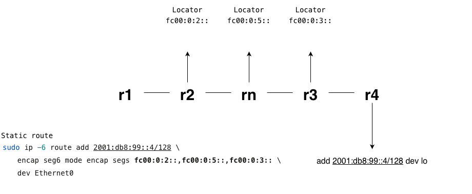

# SONiC SRV6 uSID setup for Container Lab

The key goals of this repository are:

1 - What is required to deliver SRv6 in a SONiC device deployed via Container Lab. 

2 - Build a SONiC SRv6 Container Lab setup

3- Via packets capture display the SRv6 uSID (micro SID) behaviour

There are several differences form using physical hardware due to the fact that the SAI (Switch Abstraction Interface) on a physical hardware box interacts with the ASIC while in Container Lab it will interact with the kernel, which has some implications regarding packet forwarding.

## Container Lab image

The [`srv6-usid-chain.clab.yml`](./srv6-usid-chain.clab.yml) file declaratively describes the lab, inside that file the image currently being used for SONiC is the following one:

```
topology:
  kinds:
    sonic-vm:
      image: registry.srlinux.dev/pub/sonic_converted_vm_image:202511
```

Any other image can be used as long as it supports SRv6, and in the repository [sonic-l2ls-evpn-containerlab](https://github.com/missoso/sonic-l2ls-evpn-containerlab) there are details on how to build your own image if required.

It is possible that SRv6 is compiled-in on the SONiC build but not active in the kernel (which is the case for the image above), check:

```
grep -E "SEG6|LWTUNNEL" /boot/config-$(uname -r)
cat /proc/sys/net/ipv6/conf/all/seg6_enabled
```
If the second command returns 0 the following commands are required to enable SRv6 in the kernel:
```
sudo sysctl -w net.ipv6.conf.all.seg6_enabled=1
sudo sysctl -w net.ipv6.conf.all.seg6_require_hmac=0
```
All of the deployment steps are detailed throughout this repository, this one sits at the top because an image with such characteristics is mandatory.

The last note is that the usage of *kind: sonic-vm* requires CPU virtualization support, if not enabled then the following error message will be displayed:

```bash
Cpu virtualization support is required for node "leaf1" (sonic-vm).
```

It is not recommended to use *kind: sonic-vs* since that doesn't really mimic well a SONiC device,  processes like shmp, swss, bgp will not be running in separate containers, , and that approach has not been used or tested in this repository. 

## Setup
[`srv6-usid-chain.clab.yml`](./srv6-usid-chain.clab.yml)
```
r1 ── r2 ── rn ── r3 ── r4
```

rn has a different name for potentially in the future create a "non SRv6 router in the middle setup" to see how the uSID transits a non SRv6 capable of router, for now, it is just a simple router.


| Router | AS    | Loopback IPv6     | uSID Locator   | Interfaces       |
|--------|-------|-------------------|----------------|------------------|
| r1     | 65001 | 2001:db8:1::1/128 | fc00:0:1::/48  | Ethernet0        |
| r2     | 65002 | 2001:db8:2::1/128 | fc00:0:2::/48  | Ethernet0, Eth4  |
| rn     | 65005 | 2001:db8:5::1/128 | fc00:0:5::/48  | Ethernet0, Eth4  |
| r3     | 65003 | 2001:db8:3::1/128 | fc00:0:3::/48  | Ethernet0, Eth4  |
| r4     | 65004 | 2001:db8:4::1/128 | fc00:0:4::/48  | Ethernet0        |

| Link           | Left IP            | Right IP           |
|----------------|--------------------|--------------------|
| r1:Eth0↔r2:Eth0 | 2001:db8:12::1/64 | 2001:db8:12::2/64  |
| r2:Eth4↔rn:Eth0 | 2001:db8:25::2/64 | 2001:db8:25::5/64  |
| rn:Eth4↔r3:Eth0 | 2001:db8:53::5/64 | 2001:db8:53::3/64  |
| r3:Eth4↔r4:Eth0 | 2001:db8:34::3/64 | 2001:db8:34::4/64  |


## 🚀 Deployment & Quick Start

# Step 1 - Deploy the virtual topology

```bash
containerlab deploy -t srv6-usid-chain.clab.yml --reconfigure
```

```bash
╭──────┬──────────────────────────────────────────────────────────┬───────────┬────────────────╮
│ Name │                        Kind/Image                        │   State   │ IPv4/6 Address │
├──────┼──────────────────────────────────────────────────────────┼───────────┼────────────────┤
│ r1   │ sonic-vm                                                 │ running   │ 172.80.70.11   │
│      │ registry.srlinux.dev/pub/sonic_converted_vm_image:202511 │ (healthy) │ N/A            │
├──────┼──────────────────────────────────────────────────────────┼───────────┼────────────────┤
│ r2   │ sonic-vm                                                 │ running   │ 172.80.70.12   │
│      │ registry.srlinux.dev/pub/sonic_converted_vm_image:202511 │ (healthy) │ N/A            │
├──────┼──────────────────────────────────────────────────────────┼───────────┼────────────────┤
│ r3   │ sonic-vm                                                 │ running   │ 172.80.70.13   │
│      │ registry.srlinux.dev/pub/sonic_converted_vm_image:202511 │ (healthy) │ N/A            │
├──────┼──────────────────────────────────────────────────────────┼───────────┼────────────────┤
│ r4   │ sonic-vm                                                 │ running   │ 172.80.70.14   │
│      │ registry.srlinux.dev/pub/sonic_converted_vm_image:202511 │ (healthy) │ N/A            │
├──────┼──────────────────────────────────────────────────────────┼───────────┼────────────────┤
│ rn   │ sonic-vm                                                 │ running   │ 172.80.70.15   │
│      │ registry.srlinux.dev/pub/sonic_converted_vm_image:202511 │ (healthy) │ N/A            │
╰──────┴──────────────────────────────────────────────────────────┴───────────┴────────────────╯
```

> [!NOTE]
> Wait until all the containers status is "healthy", it may take a few minutes until they all move from "starting" to "healthy", monitor with "docker ps | grep $container_name" or simply run the "containerlab inspect" in the same directory of the deployment.

# Step 1 - Deploy SONiC config files 

The folder named **configs** contains both the config_db.json and the frr.conf for each node, the python scripts [`deploy_config_db_json.py`](./deploy_config_db_json.py) and [`deploy_config_frr.py`](./deploy_config_frr.py) can automate these steps, they just require the [`paramiko`](https://www.paramiko.org/) and [`SCP`](https://pypi.org/project/scp/) packages.

These scripts will look info that **configs** folder and "find" hosts by checking which files exist with the format $host_name$_config_db.json and $host_name$_frr.conf

# Step 1.1  - Deploy **config_db.json**

Showing the detaied output for R1 only:
```bash
$ python3 deploy_config_db_json.py 
Found 5 host(s): ['r1', 'r2', 'r3', 'r4', 'rn']

[r1] Connecting...
[r1] Uploading /home/nokia/srv6-usid-chain/configs/r1_config_db.json -> /tmp/config_db.json
[r1] Running: sudo cp /tmp/config_db.json /etc/sonic/config_db.json
[r1] Running: sudo config reload -y
[r1] admin
admin
Acquired lock on /etc/sonic/reload.lock
admin
Stopping SONiC target ...
Running command: /usr/local/bin/sonic-cfggen -j /etc/sonic/init_cfg.json -j /etc/sonic/config_db.json --write-to-db
Running command: /usr/local/bin/db_migrator.py -o migrate
Running command: /usr/local/bin/sonic-cfggen -d -y /etc/sonic/sonic_version.yml -t /usr/share/sonic/templates/sonic-environment.j2,/etc/sonic/sonic-environment
Restarting SONiC target ...
Reloading Monit configuration ...
Reinitializing monit daemon
Released lock on /etc/sonic/reload.lock
[r1] Done.
[...]
[...]
[...]
--- Summary ---
  r1: OK
  r2: OK
  r3: OK
  r4: OK
  rn: OK
```
This step takes some time because of the config reload

# Step 1.2 - Deploy **frr.conf**

Showing the detaied output for R1 only:
```bash
$ python3 deploy_config_frr.py 
Found 5 host(s): ['r1', 'r2', 'r3', 'r4', 'rn']

[r1] Connecting...
[r1] Uploading /home/nokia/srv6-usid-chain/configs/r1_frr.conf -> /tmp/frr.conf
[r1] Running: sudo cp /tmp/frr.conf /etc/sonic/frr/frr.conf
[r1] Running: sudo vtysh -f /etc/sonic/frr/frr.conf
[r1] admin
admin
admin
[228|mgmtd] sending configuration
[229|zebra] sending configuration
[235|bgpd] sending configuration
[245|staticd] sending configuration
Waiting for children to finish applying config...
[235|bgpd] done
[229|zebra] done
[245|staticd] done
[228|mgmtd] done
[r1] Done.
[...]
[...]
[...]
--- Summary ---
  r1: OK
  r2: OK
  r3: OK
  r4: OK
  rn: OK
```


# Step 2 - Enable SRv6 in the kernel (if required)

In all devices execute the following commands:
```
sudo sysctl -w net.ipv6.conf.all.seg6_enabled=1
sudo sysctl -w net.ipv6.conf.all.seg6_require_hmac=0
```

Optional - If desired to make it persistent across reboot:
```
cat << 'EOF' | sudo tee /etc/sysctl.d/99-srv6.conf
net.ipv6.conf.all.seg6_enabled=1
net.ipv6.conf.all.seg6_require_hmac=0
EOF
```

> [!NOTE]
> This step and all the way to step 4 can de executed in an automated manner by running the script [`setup_SRv6.py`](./setup_SRv6.py)


# Step 3 - SRv6 forwarding plane configuration

Contrarily to a physical SONiC device the following configuration inside FRR is **not accepted**:
```
segment-routing
 srv6
  locators
   locator MAIN
    prefix fc00:0:1::/48 block-len 32 node-len 16 func-bits 0
   !
  !
 !
!
```

In a nutshell there is no SAI - ASIC link here (software stub SAI instead of a real ASIC driver), so when *FRR* tries to apply the above the *zebra* component of it (that actually installs routes in kernel amongst other things) checks if the SAI/dataplane supports SRv6, he stub SAI returns "not supported", and FRR rejects the configuration entirely.

This does require some gymnastic and some extra steps.

**Step 3.1 - Add the SRv6 locators**


Write the SRv6 locators directly to the Linux kernel routing table thus bypassing the entire SONiC control plane stack 


```
#    r1:
sudo ip -6 route add fc00:0:1::/48 dev Loopback0
#    r2:
sudo ip -6 route add fc00:0:2::/48 dev Loopback0
#    rn:
sudo ip -6 route add fc00:0:5::/48 dev Loopback0
#    r3:
sudo ip -6 route add fc00:0:3::/48 dev Loopback0
#    r4:
sudo ip -6 route add fc00:0:4::/48 dev Loopback0
```

**Step 3.2 - Configure transit devices**

Transit devices (r2 and rn) require a special configuration due to the fact that the SRv6 locators were added manually and directly as kernel routes.

Using r2 as an example the locator fc00:0:2:: will exist in the kernel routing table as "normal/plain" route, so when the packet arrives for that locator the kernel will just see a packed destined to fc00:0:2:: and perform IPv6 forwarding, which in this case results to the packet being delivered locally (as in without the seg6local encap) and the SRH (Segment Routing Header) is never inspected. 

It is required to instruct the kernel that when a packet is received to fc00:0:2:: it is to be treated as an SRv6 SID, apply the end behaviour and then forward it. This is achieved via the *"encap seg6local action End"*, that ensure the SRH processing and the packet being forwarded onwards (the following commands should be issued after BGP has converged):

```
# r2:
sudo ip -6 route replace fc00:0:2::/48 encap seg6local action End dev Loopback0

# rn:
sudo ip -6 route replace fc00:0:5::/48 encap seg6local action End dev Loopback0
```


**Step 3.3 - Terminate SRv6 domain at r3 and not at r4**

Although the ping is sourced from r1 towards r4, the SRv6 forwarding must end at r3 and then the packet is forwarded as normal IPv6 towards r4. This is solely due to the fact this is a virtual SONiC device. A simplified explanation of why: the forwarding plane is a Linux kernel which runs a software bridge that processes packets at L2 before they reach the kernel's IPv6 routing stack. When an SRv6 encapsulated packet arrives at R4, the SONiC software bridge intercepts it first. By the time the packet would reach the kernel's seg6local processing (where End.DT6 would decapsulate it and do a routing table lookup), the bridge has already made a forwarding decision, and the packet never reaches that code path.

```
# r3:
sudo ip -6 route replace fc00:0:3::/48 encap seg6local action End.DT6 table main dev Ethernet0
```

On physical SONiC hardware this limitation does not exist — the ASIC  handles SRv6 termination before any software bridge is involved, so End.DT6 on R4 would work correctly.

**Step 3.4 - Configure endpoint**

Create the destination in r4
```
# r4:
sudo ip -6 addr add 2001:db8:99::4/128 dev lo
```

# Step 4 - uSID programming

Define a static route towards the endpoint that exists in r4, defining the SID's to be crossed
```
# r1:
sudo ip -6 route add 2001:db8:99::4/128 \
  encap seg6 mode encap segs fc00:0:2::,fc00:0:5::,fc00:0:3:: \
  dev Ethernet0
```
r2 - fc00:0:2::

rn - fc00:0:5::

r3 - fc00:0:3::


## 🚀 SRv6 traffic flow




```
r1 encapsulates:  segs fc00:0:2:: → fc00:0:5:: → fc00:0:3::
r2: End (segleft 3→2, forwards to rn)
rn: End (segleft 2→1, forwards to r3)
r3: End.DT6 (decapsulates, forwards plain IPv6 to r4)
r4: receives plain IPv6, replies via BGP
```

r1 
```
admin@r1:~$ ping6 2001:db8:99::4 -I 2001:db8:1::1 -c 5
PING 2001:db8:99::4 (2001:db8:99::4) from 2001:db8:1::1 : 56 data bytes
64 bytes from 2001:db8:99::4: icmp_seq=1 ttl=61 time=11.1 ms
64 bytes from 2001:db8:99::4: icmp_seq=2 ttl=61 time=13.6 ms
64 bytes from 2001:db8:99::4: icmp_seq=3 ttl=61 time=11.9 ms
64 bytes from 2001:db8:99::4: icmp_seq=4 ttl=61 time=12.4 ms
64 bytes from 2001:db8:99::4: icmp_seq=5 ttl=61 time=19.1 ms

--- 2001:db8:99::4 ping statistics ---
5 packets transmitted, 5 received, 0% packet loss, time 4007ms
rtt min/avg/max/mdev = 11.108/13.611/19.091/2.854 ms
```

Capture in r2 (check the RT6 field)
```
admin@r2:~$ sudo tcpdump -i Ethernet0 -n -v ip6
tcpdump: listening on Ethernet0, link-type EN10MB (Ethernet), snapshot length 262144 bytes
13:38:40.616118 IP6 (flowlabel 0x530ce, hlim 64, next-header Routing (43) payload length: 160) 2001:db8:12::1 > fc00:0:2::: RT6 (len=6, type=4, segleft=2, last-entry=2, flags=0x0, tag=0, [0]fc00:0:3::, [1]fc00:0:5::, [2]fc00:0:2::) IP6 (flowlabel 0x530ce, hlim 64, next-header ICMPv6 (58) payload length: 64) 2001:db8:1::1 > 2001:db8:99::4: [icmp6 sum ok] ICMP6, echo request, id 8, seq 1
```

Capture in rn (check the RT6 field)
```
admin@rn:~$ sudo tcpdump -i Ethernet0 -n -v ip6
tcpdump: listening on Ethernet0, link-type EN10MB (Ethernet), snapshot length 262144 bytes
13:38:41.216963 IP6 (flowlabel 0x530ce, hlim 63, next-header Routing (43) payload length: 160) 2001:db8:12::1 > fc00:0:5::: RT6 (len=6, type=4, segleft=1, last-entry=2, flags=0x0, tag=0, [0]fc00:0:3::, [1]fc00:0:5::, [2]fc00:0:2::) IP6 (flowlabel 0x530ce, hlim 64, next-header ICMPv6 (58) payload length: 64) 2001:db8:1::1 > 2001:db8:99::4: [icmp6 sum ok] ICMP6, echo request, id 8, seq 1
```

Capture in r3 (check the RT6 field)
```
admin@r3:~$ sudo tcpdump -i Ethernet0 -n -v ip6
tcpdump: listening on Ethernet0, link-type EN10MB (Ethernet), snapshot length 262144 bytes
13:38:41.265869 IP6 (flowlabel 0x530ce, hlim 62, next-header Routing (43) payload length: 160) 2001:db8:12::1 > fc00:0:3::: RT6 (len=6, type=4, segleft=0, last-entry=2, flags=0x0, tag=0, [0]fc00:0:3::, [1]fc00:0:5::, [2]fc00:0:2::) IP6 (flowlabel 0x530ce, hlim 64, next-header ICMPv6 (58) payload length: 64) 2001:db8:1::1 > 2001:db8:99::4: [icmp6 sum ok] ICMP6, echo request, id 8, seq 1
```

1 - All the micro segments are compressed into one IPv6 address, and not 128 bits per SID as we would have without uSID

2 - RT6 field set to "[0]fc00:0:3::, [1]fc00:0:5::, [2]fc00:0:2::" (the "next one" is at the bottom), so r1 places r2 ([2]fc00:0:2::) at the end then rn ([1]fc00:0:5::) and then r3 ([0]fc00:0:3::)

3 - They key variation is the field *segleft* (how many segments are left), which equals 2 in r2, equals 1 in rn and equals 0 in r3


## 🧹 Cleanup

To stop the lab and remove all containers:

```bash
containerlab destroy -t srv6-usid-chain.clab.yml --cleanup
```


